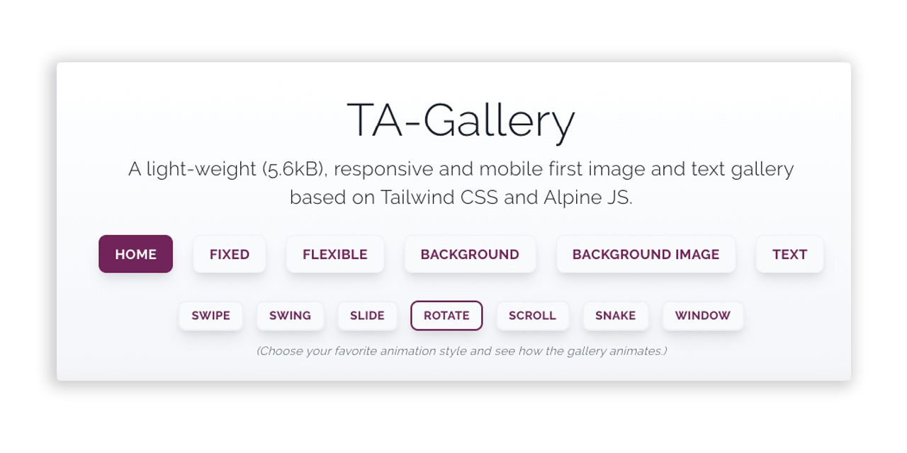

<p align="center">
  
</p>

## TA-Gallery

An image and content gallery which is 100% customizable and has endless animation options. If you already use Tailwind CSS and Alpine JS in your project you might consider using TA-Gallery.

Use TA-Gallery as a part of your Tailwind CSS and Alpine JS project. You can use it as a stand alone version but it works best together with your own scripts and enhancements. The gallery is designed to fit in every project, in every grid and in every flexbox based on these two frameworks so please try it out and if you have some feedback.

## Demos and documentation

For more details about the TA-Gallery take a look at <https://ta-gallery.markusantonwolf.com>

## Download

TA Gallery is released under the MIT license & supports modern environments.

## Local development

```
// To install dev dependencies run:

npm install

// To start the development server run and go to http://localhost:8888/:

npm run serve

// To make a development build run:

npm run develop

// To make a production build run:

npm run build
```

## Copyright

© 2019-2020 Markus A. Wolf
<https://www.markusantonwolf.com>
